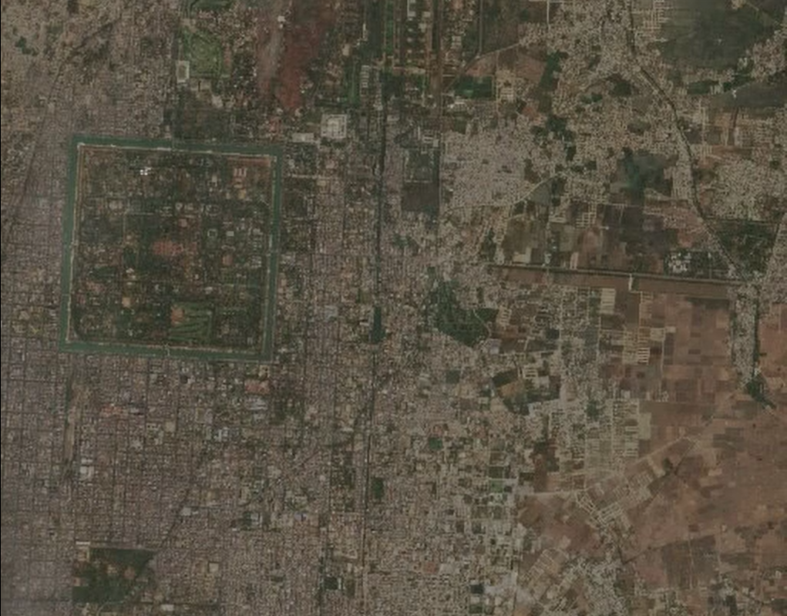

<!DOCTYPE html>
<html lang="it">

<head>
    <meta charset="UTF-8">
    <meta name="viewport" content="width=device-width, initial-scale=1.0">
    <title> Terremoto in Myanmar </title>
    <link rel="stylesheet" href="CSS/STILE.css">
</head>

<body>
    <header>
        <h1> TERREMOTO IN MYANMAR </h1>
        <h2> Conseguenze di un sisma devastante </h2>
    </header>
    <main>
        
        

            <h2> Alcuni dati importanti: </h2>
            

                Il terremoto in Myanmar, più precisamente il terremoto di Sagaing del 2025 è stato un evento
                sismico avvenuto in Birmania il 28 Marzo 2025 verso le 12 e 50.
            

            

                La scossa principale ha fatto registrare una magnitudo 7,7 ed è stata avvertita nel sud-est asiatico
                causando danni anche in Thailandia e nella Cina meridionale.
            

            

                Il sisma è avvenuto a 10 chilometri di profondità vicino alla città di Mandalay ed è risultato
                il più forte terremoto mai avvenuto dal 1912, anno in cui avvenne un sisma di magnitudo 8,0.
            

        

        <h3> Cartine dell'epicentro: </h3>

        <section class="section">
            

                
            

            

                
            

        </section>

        

            <h2> Prima e Dopo: </h2>
            

                Di seguito verranno proposte alcune immagini delle conseguenze devastanti che hanno colpito il paese,
                nello specifico sarà possibile visualizzare com'era un determinato luogo prima del terremoto e com'è
                dopo il sisma.
            

        

        
        <section class="section">
            

                
                
 PRIMA 

            

            

                
                
 DOPO 

            

        </section>

        <section class="video">
            <h3> BREVE VIDEO: </h3>
            <video width="800" controls>
                <source src="IMG/Timelapse.mp4" type="video/mp4">
            </video>
            
 
                In questo breve video è presente un timelapse che visualizza il prima 
                e dopo in una vasta area selezionata.
            

        </section>

    </main>
    <footer>
        
 © 2025. Tutti i diritti riservati. 

    </footer>
</body>

</html>
